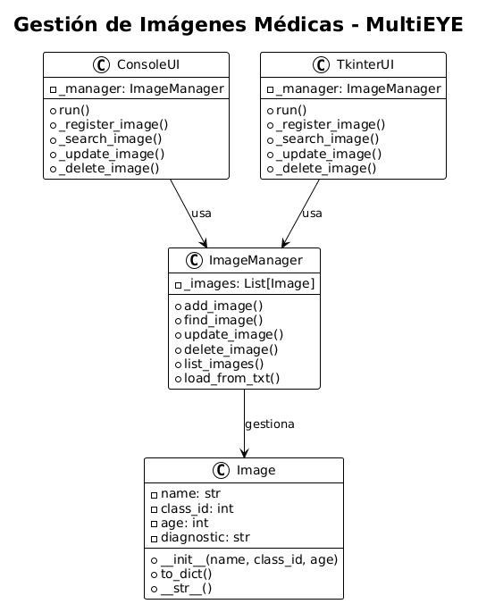

# Sistema de Gestión de Imágenes Médicas

Sistema modular para la gestión de imágenes médicas de fondo de ojo del dataset MultiEYE.

Este proyecto implementa un módulo completo de gestión de imágenes médicas que permite:

- Registrar nuevas imágenes con sus metadatos
- Buscar imágenes por nombre
- Modificar metadatos de imágenes existentes
- Eliminar imágenes del sistema

## Descripción

Este proyecto implementa un módulo completo de gestión de imágenes médicas que permite:

- Registrar nuevas imágenes con sus metadatos
- Buscar imágenes por nombre
- Modificar metadatos de imágenes existentes
- Eliminar imágenes del sistema
- Listar y filtrar imágenes
- Importar datos desde archivos TXT

## Dataset: MultiEYE

El sistema trabaja con el dataset MultiEYE de imágenes de fondo de ojo, clasificadas en 8 categorías:

| Clase | Diagnóstico | Descripción |
|-------|-------------|-------------|
| 0 | Normal | Ojo sano |
| 1 | dAMD | Degeneración Macular Relacionada con la Edad (seca) |
| 2 | CSC | Coriorretinopatía Serosa Central |
| 3 | DR | Retinopatía Diabética |
| 4 | GLC | Glaucoma |
| 5 | MEM | Membrana Epirretiniana Macular |
| 6 | RVO | Oclusión de la Vena Retiniana |
| 7 | wAMD | Degeneración Macular Relacionada con la Edad (húmeda) |


## Estructura del Proyecto

```
proyecto/
│
├── domain/
│   ├── __init__.py
│   └── image.py            # Entidad Image
│
├── error/                  # Paquete de errores (transversal)
│   ├── __init__.py
│   ├── base.py             # Excepción base
│   ├── not_found.py        # Imagen no encontrada
│   └── duplicate.py        # Imagen duplicada
│
├── application/
│   ├── __init__.py
│   └── image_manager.py    # Lógica de negocio (CRUD)
│
├── infrastructure/
│   ├── __init__.py
│   └── csv_repository.py   # Persistencia en CSV
│
├── ui/
│   ├── __init__.py
│   ├── console_ui.py       # Interfaz de consola
│   └── tkinter_ui.py       # Interfaz gráfica
│
├── docs/                   # Documentación del proyecto
│   ├── sphinx/             # Documentación Sphinx
│   ├── class_diagram.puml  # Diagrama de clases (PlantUML)
│   └── diagrama_imagenes.png # Diagrama de imágenes
│
│
├── data/                   # Datos del proyecto
│   ├── ImageData/          # Imágenes del dataset MultiEYE
│   └── large9cls.txt       # Etiquetas de clasificación
│
├── storage/                # Almacenamiento local
│   └── image_data.csv      # Base de datos CSV
│
├── main.py                 # Punto de entrada
└── README.md               # Este archivo
```


## Requisitos

- **Python 3.8 o superior**
- No requiere instalación de dependencias externas

## Cómo Ejecutar

```bash
py main.py
```

Al ejecutar, podrás elegir entre:
1. **Interfaz de Consola** - Terminal tradicional
2. **Interfaz Gráfica** - Ventana con Tkinter

o también:

```bash
python main.py
```


### Diagrama de Clases


## Documentación

El proyecto incluye documentación completa generada con **Sphinx**:

### Ver Documentación Online

**Documentación disponible en**: [https://multieye-doc.netlify.app/](https://multieye-doc.netlify.app/)


## Autores

**Equipo de Desarrollo - Proyecto Final**
*Curso: Fundamentos de Ingeniería de Software para Científicos de Datos - MIAV1E5*

### Integrantes del Equipo

1. **Julieta Flores Tantani**
2. **Jorge Robbert Lozano Barro**
3. **Delfina Casilda Villafuerte Romero**
4. **Rodolfo Rafael Wayar Tateishi**

## Licencia

Este proyecto es parte de un trabajo académico. Puede ser utilizado con fines educativos y de investigación.


